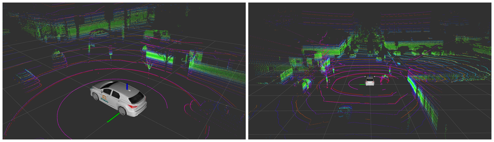
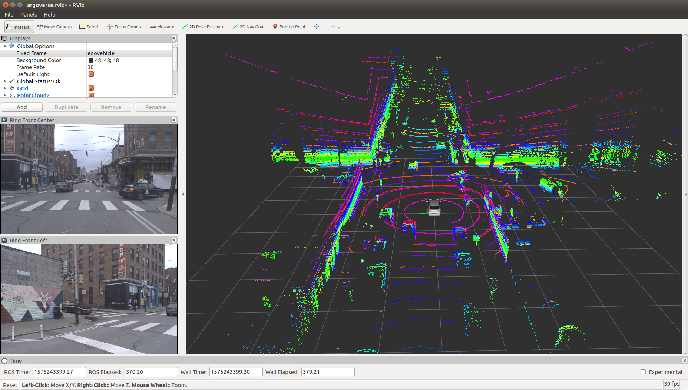

[](https://www.python.org/downloads/release/python-270/)
[](https://www.python.org/downloads/release/python-360/)
[](./LICENSE)

# Argoverse ROS
ROS API and utils for the Argoverse dataset.



## Table of Contents

- [Quick Guide](#quick-guide)
- [Installation](#installation)
- [TODO](#todo)
- [Links](#links)

## Quick Guide
Currently, you can convert the Argoverse-Tracking sequences to ROS bag files. Clone the `argoverse_ros` ROS package into your workspace `src` directory.

### Create ROS bags

Run the following command to convert a log sequence to a bag file. Example to convert the sample tracking sequence log.

```
roslaunch argoverse_ros create_rosbag.launch \
    dataset_dir:=/path/to/argoverse-tracking/sample
    log_id:=c6911883-1843-3727-8eaa-41dc8cda8993
    cameras:="'ring_front_center ring_front_left'"  # Note the single quotes
```

List of cameras available: `ring_front_center`, `ring_front_left`, `ring_front_right`, `ring_rear_left`, `ring_rear_right`, `ring_side_left`, `ring_side_right`, `stereo_front_left`, `stereo_front_right`.

The following topics will be created in the bag file (saved to `argoverse_ros/bags/<LOG_ID>.bag`).

```
/argoverse/lidar/pointcloud
/argoverse/<CAMERA_NAME>/image_rect
/argoverse/<CAMERA_NAME>/camera_info
/tf
/tf_static
```

### Visualize in Rviz

Run the following command to visualize the data in Rviz.

```
roslaunch argoverse_ros rviz.launch
```



## Installation
The Argoverse API only supports Python3.6 and above. Install Python3.6 and the dependent libraries if you don't already have it.

```
sudo add-apt-repository ppa:deadsnakes/ppa
sudo apt-get update
sudo apt-get install python3.6
```

Install the Argoverse API as below, optionally you can clone the repository and specify the path to the `argoverse` directory in `$PYTHONPATH`.

```
sudo pip3.6 install --ignore-installed git+https://github.com/argoai/argoverse-api.git
```

Some of the scripts need the ROS Bag API with Python3, install the following packages.

```
sudo apt-get install python3-pip python3-yaml
sudo pip3 install rospkg catkin_pkg
```

Install the requirements for both Python2 and Python3.6.

```
sudo pip2 install -r requirements.txt
sudo pip3.6 install -r requirements.txt
```

Setup the `argoverse_ros` package.

```
mkdir -p ~/argo_ws/src
git clone https://github.com/heethesh/argoverse_ros ~/argo_ws/src
cd ~/argo_ws
catkin_make
source devel/setup.bash
```

NOTE: There are issues with running `CvBridge` with Python3. To keep things simple, all messages are converted to ROS topics in the bag file using Python3.6 (which the Argoverse API requires) except for images which are appended later into the bag file using Python2.7. The `create_rosbag.sh` script will do it all for you.

## TODO
#### ROS Bag API
- [ ] Simplify image conversion using CvBridge (maybe switch to Python3.6 completely).
- [ ] Batch log conversion.
- [ ] Verfiy quaternion convention from Argoverse in TF.
- [ ] Option to resize images.
- [ ] Handle CameraInfo messages for stereo images.
- [ ] Support ground truth 3D bounding box messages and visualization markers.
- [ ] Support tracker annotations.
- [ ] Support for HD map annotations.
- [ ] Support for motion forecasting logs.

#### Other Features
- [ ] Publish logs directly from file.
- [ ] Integrate SLAM/Visual Odometry packages.

## Links
- [Argoverse API](https://github.com/argoai/argoverse-api)
- [Argoverse Dataset](https://www.argoverse.org/)
- The vehicle URDF was borrowed from [Autoware](https://gitlab.com/autowarefoundation/autoware.ai/visualization/tree/master/vehicle_description)
